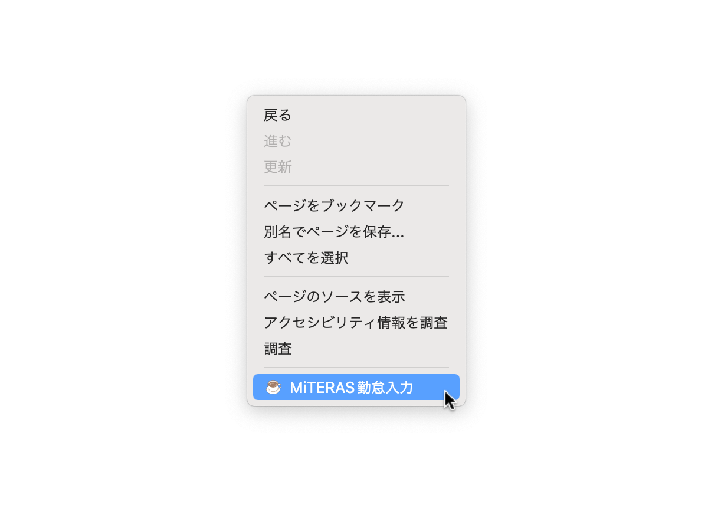

# 🚀 MiTERAS勤怠入力

これは、MiTERAS勤怠の休憩時間を自動的に入力するFirefox拡張機能です。

## インストール方法

Firefox公式サイトからインストールできます。

<https://addons.mozilla.org/ja/firefox/addon/miteras-kintai-helper/>

## 初期設定

1. アドオンの設定画面を開いて、休憩時間の設定を行ってください。

## 使用方法

1. MiTERAS勤怠上の休憩時間の入力画面でコンテキストメニューを表示する。（通常は右クリック）
1. コンテキストメニューから「MiTERAS勤怠入力」を選択する。
1. 休憩時間が自動的に入力されます。
